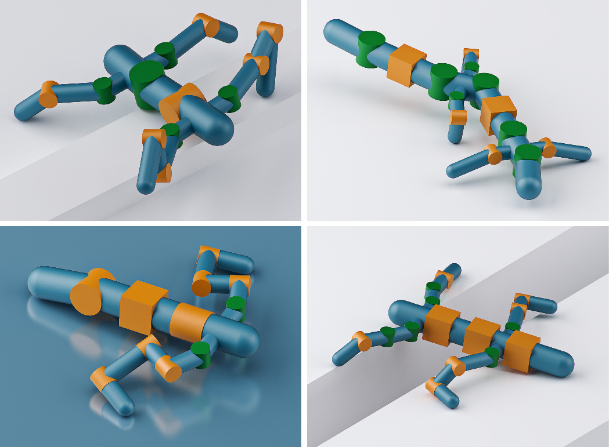

# RoboGrammar



*A selection of best-performing designs generated with RoboGrammar for four different terrains.*

## Prerequisites

[CMake](https://cmake.org/download/) >= 3.8
* Ubuntu: The version available through `apt-get` is probably outdated, install from the link above

GLEW
* Ubuntu: `sudo apt-get install libglew-dev`

Python 3.6 + headers

If you are on an older version of Ubuntu, you may need to add the "deadsnakes" PPA first:
```
sudo add-apt-repository ppa:deadsnakes/ppa
sudo apt-get update
```
* Ubuntu: `sudo apt-get install python3.6 python3.6-dev`

## Building (Linux, Mac OS)

`git clone git@github.com:allanzhao/robot_design.git`

`cd robot_design`

`git submodule update --init`

`mkdir build; cd build`

`cmake -DCMAKE_BUILD_TYPE=RelWithDebInfo -DPYTHON_EXECUTABLE=/path/to/python3.6 ..` (replace `/path/to/python3.6` as appropriate)

`make -j4` (replace 4 with the number of CPU cores available)

## Installing Python Packages

Using a virtualenv is recommended.

Add the `robot_design/build/examples/python_bindings` and the `robot_design/examples/design_search` directories to your `PYTHONPATH` environment variable, and make sure you are in the `robot_design` directory.

`virtualenv -p python3.6 venv`

`source venv/bin/activate`

`pip3 install numpy numpy-quaternion`

## Running Examples

### C++ Examples

Make sure you are in the `build` directory created earlier.

View an example robot design:
`examples/viewer/Viewer ../data/designs/insect.dot 0 1 1 1 2 2 2 3 3 3 5 5 5 4 4 4 -r`

Optimize and view a trajectory for the example robot:
`examples/viewer/Viewer ../data/designs/insect.dot 0 1 1 1 2 2 2 3 3 3 5 5 5 4 4 4 -o -r`

View a rule from the grammar:
`examples/rule_viewer/RuleViewer ../data/designs/insect.dot 0 rhs -r` (views the right-hand side of rule 0)

### Python Examples

Make sure you are in the `robot_design` directory and the virtualenv is active (`source venv/bin/activate`).

Optimize and view a trajectory for the example robot:
`python3 examples/design_search/viewer.py FlatTerrainTask data/designs/grammar_jan21.dot -j16 0, 6, 20, 12, 2, 7, 18, 20, 10, 4, 20, 10, 11, 5, 10, 4, 10, 5, 19, 5 -o`
