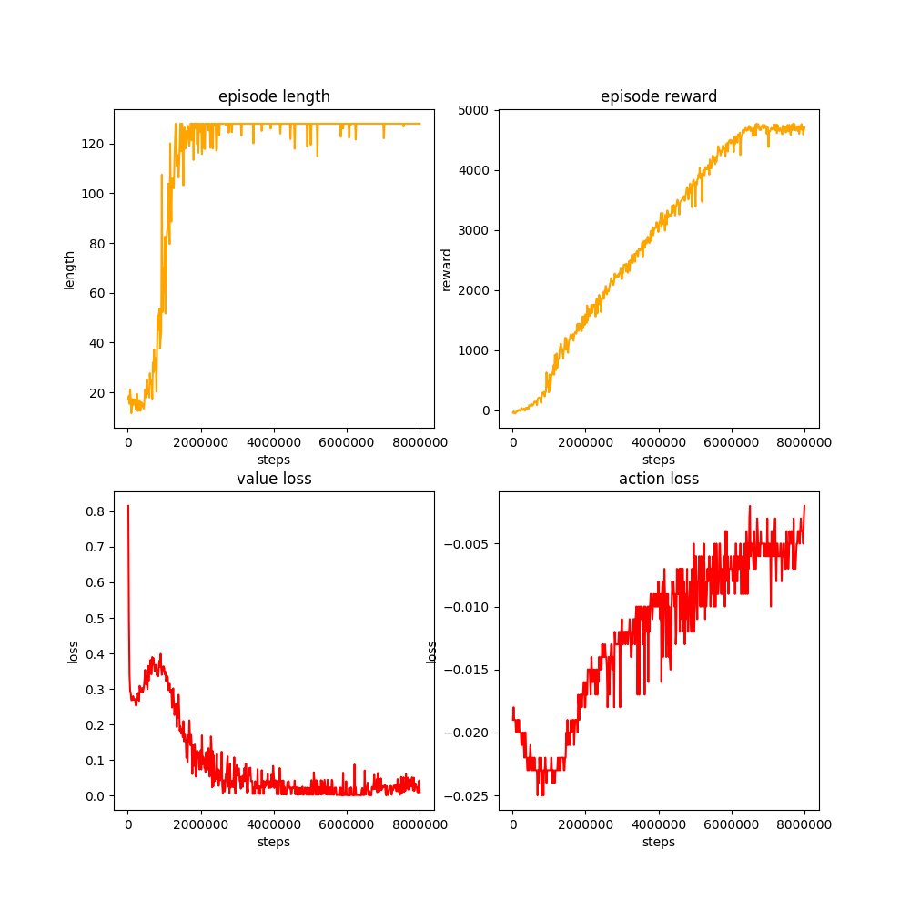

# Reinforcement Learning Baselines

##### Algorithm: PPO (Proximal Policy Optimization)


## Prerequisites

- PyTorch: Find command line instruction here: [Pytorch](https://pytorch.org/get-started/locally/)
- Tensorflow: `pip install tensorflow`
- OpenAI Gym:  `pip install gym`

* OpenAI Baselines:

  ```
  cd externals/baselines
  pip install -e .
  ```

* pytorch-a2c-ppo-acktr-gail:

  ```
  cd externals/pytorch-a2c-ppo-acktr-gail
  pip install -e .
  ```


## How to Run

Scripts for training and replaying is in `scripts/design-X/` folders.

If you are in `rl` folder, to train design 1:

```
python scripts/design-1/train.py --save-dir /directory/to/save/training/results
```

After training, to replay the trained model:

```
python scripts/design-1/play.py --model-path /path/to/saved/model.pt
```

Plot the training curve:

```
python train/plot.py --log-dir /directory/to/save/training/results
```


## Reward Function

The reward function at each sub-step is defined as:
$$
R(s_t, a_t)=V_x+0.1 (e_x^{body}\cdot e_x^{world}+e_y^{body}\cdot e_y^{world})-0.7\|a_t\|^2 / n
$$
Where, n is the dimension of the action, and action is normalized to [-1, 1].


## Results

Try different hyperparameters: number of roll-out steps in each optimization epoch and the number of total steps. The reward reported here is measured by Allan's objective definition:
$$
R(s_t, a_t)=2V_x+2(e_x^{body}\cdot e_x^{world}+e_y^{body}\cdot e_y^{world})
$$
and averaged along the whole trajectory (128 * 16 steps).

#### num-steps = 4096, total-steps = 8e6 (128M sim-steps), 2 hours

|            | Design-1 | Design-2 | Design-3 | Design-4 |
| :--------- | :------: | :------: | :------: | :------: |
| Avg Reward |  8.7239  |  8.4184  |  7.4479  |  5.9300  |

